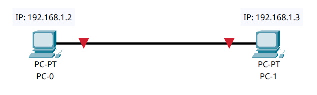
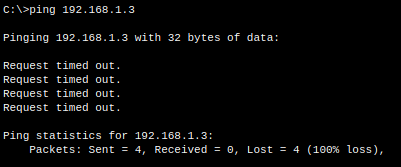
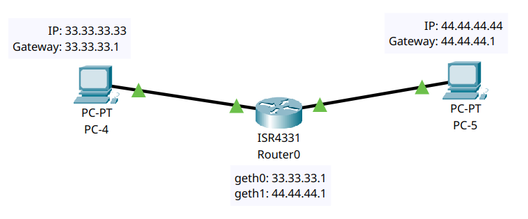
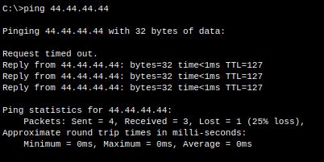
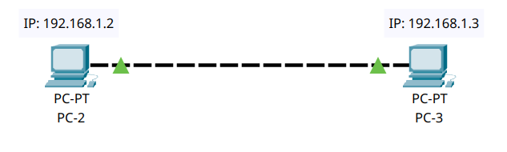
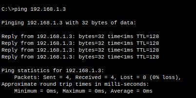
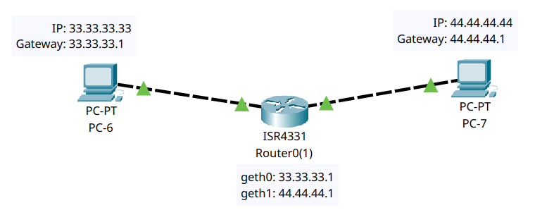

# Tutorial 1

**Abhishek M J - CS21B2018**

## Question 1

> Two End nodes Connected with the Straight Ethernet Cable. Where both end nodes are in the same network.

The connection cannot be established because both end nodes are connected using a Copper Straight-through cable.

## Question 2

> Two End nodes Connected with the Straight Ethernet Cable. Where both end nodes are in the different network.

The connection can be established because both end nodes are connected using a Copper Straight-through cable. Both the PCs are connected through a router. The router will route the packets to the destination network.

## Question 3

> Two End nodes Connected with the Cross Coupled Ethernet Cable. Where both end nodes are in the same network.

The connection can be established because both end nodes are connected using a Copper Cross Coupled cable. Both the PCs are assigned static local IP addresses in the same network.

## Question 4

> Two End nodes Connected with the Cross Coupled Ethernet Cable. Where both end nodes are in the different network.

The connection cannot be established because both end nodes are connected using a Copper Cross Coupled cable. Both the PCs are connected through a router. The router's IP Address is assigned as gateway in both the PCs. The router will route the packets to the destination network.

## Question 5

> What are ways (or technologies) two computers are directly connected and communicate with each other?

1. Ethernet (wired connection)
2. Wi-Fi (wireless connection)
3. Bluetooth (short-range wireless)
4. USB (wired connection)
5. Firewire (high-speed wired connection)
6. Serial Cable (wired connection)
7. Parallel Cable (wired connection)
8. Infrared (short-range wireless)
9. Near Field Communication (NFC)
10. Direct cable connection (DCC) using null modem cables
11. Cross-over Cable (wired connection)
12. InfiniBand (high-speed interconnect)
13. Fiber Channel (high-speed storage networking)
14. Point-to-Point Protocol (PPP) over serial interfaces
15. Virtual Private Network (VPN)
16. Thunderbolt (high-speed interface)
17. Parallel ATA (PATA)
18. Serial ATA (SATA)
19. eSATA (External SATA)
20. USB On-The-Go (OTG)
21. Zigbee (low-power wireless)
22. Z-Wave (home automation wireless)
23. Powerline Communication (data over electrical wiring)

These technologies cover a range of wired and wireless methods to directly connect two computers for data transfer and communication.