# Problem Statement

Write a Server program with threads, where each thread can handle a single client.
- Ensure server get connected to multiple clients.
- All the client messages to be displayed in server.
- Provide a mechanism to disconnect the client.

# Implementation 1: Demonstrate with local loop IP

## `server.py`:

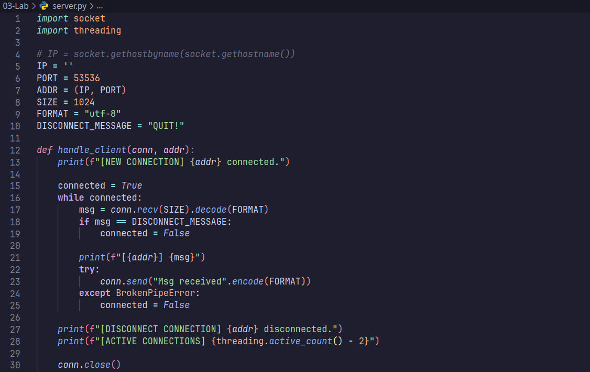
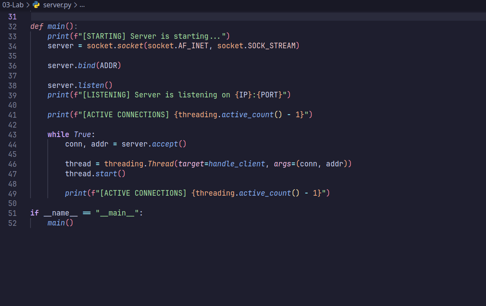

## `client.py`:

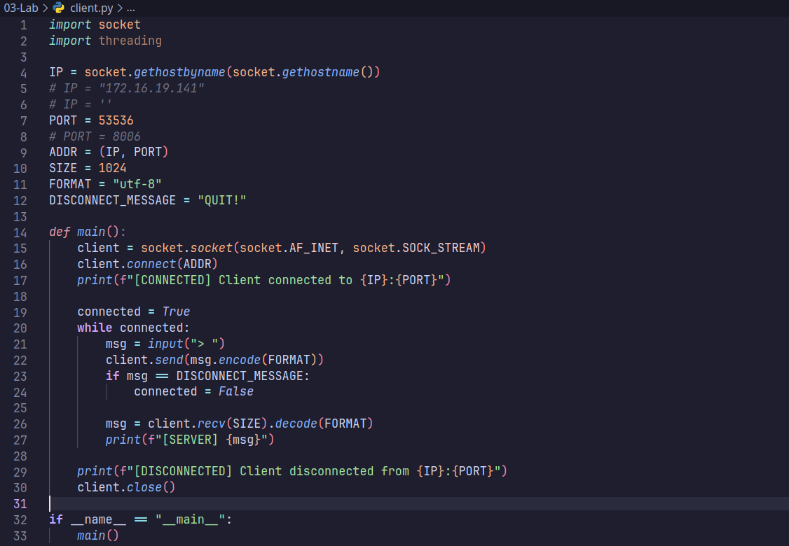

## Output:

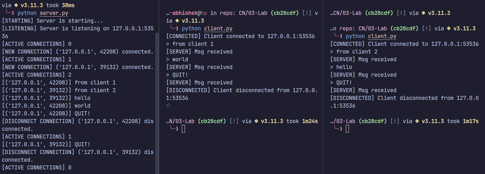

\break
\break

# Implementation 2: Connect with multiple client with different IPs

## `server.py` and `client.py`:

Same as above

## Output:

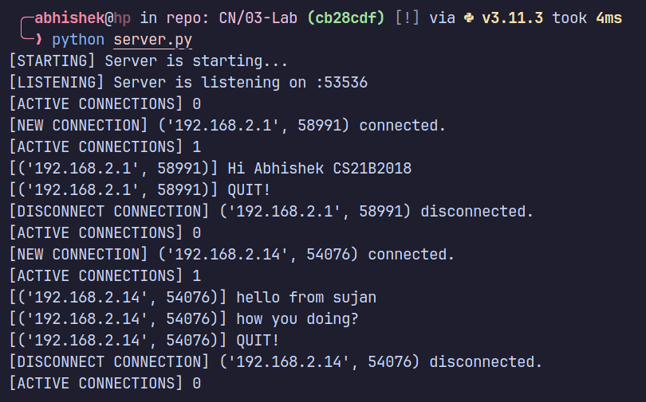
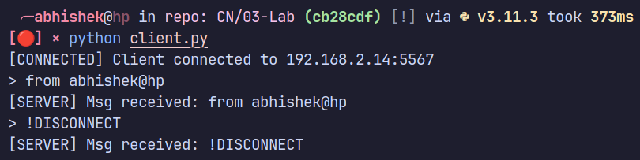
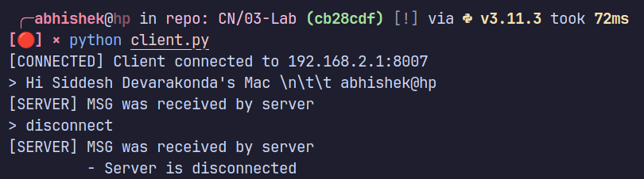

# Implementation 3: Modify the program where server can send messages to specific client

## `server.py`:

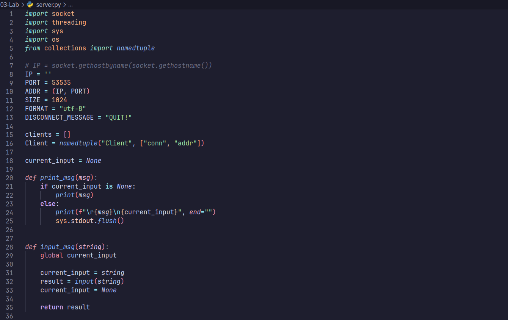
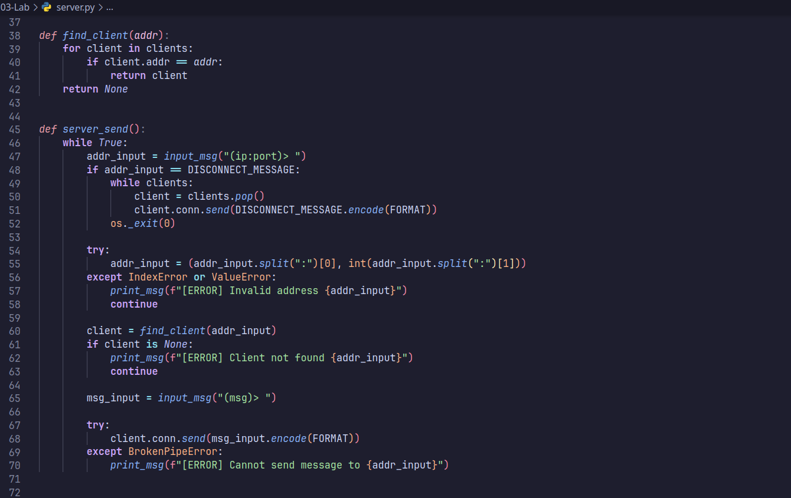
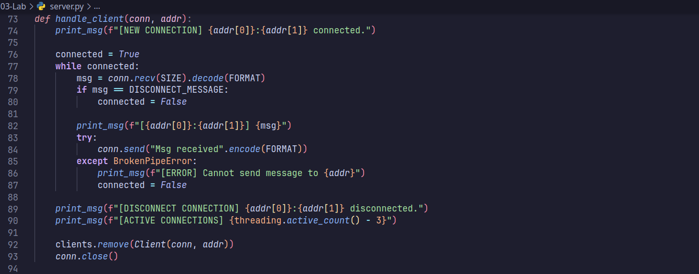
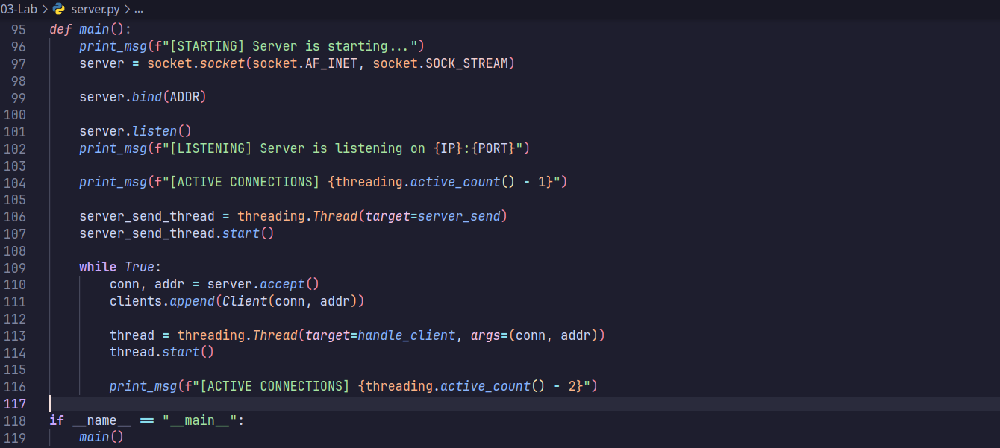

## `client.py`:

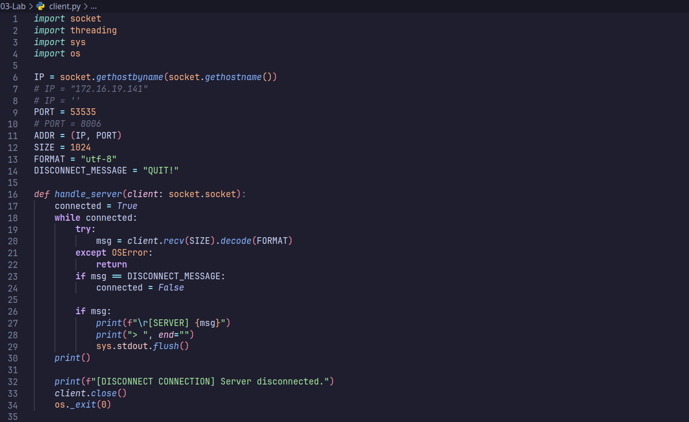
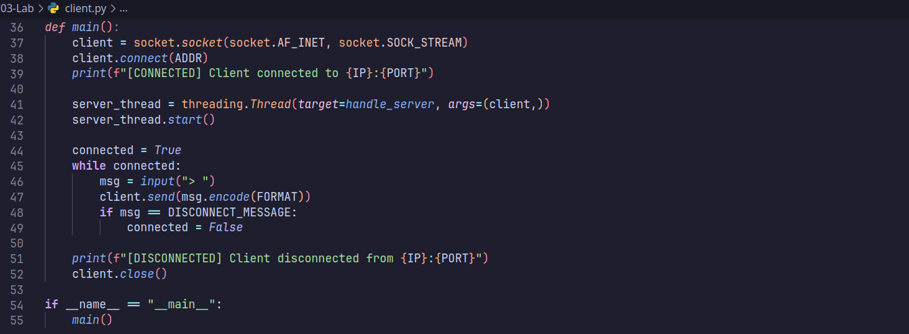

## Output:

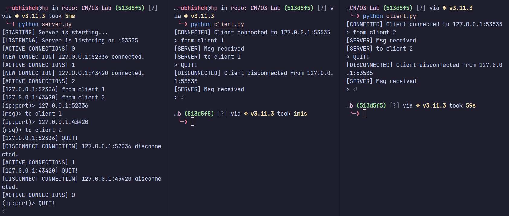