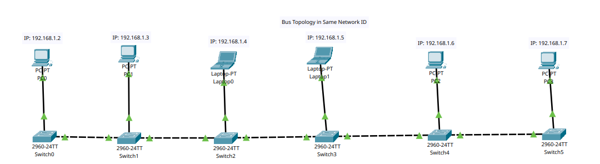
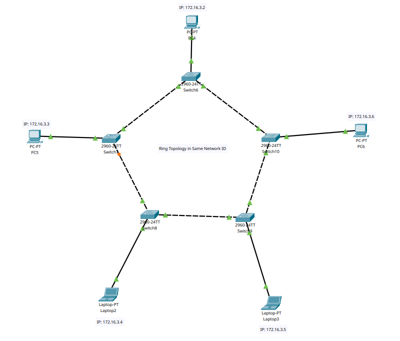
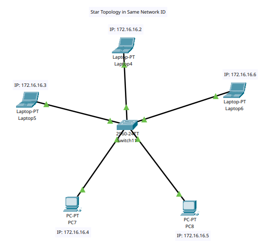
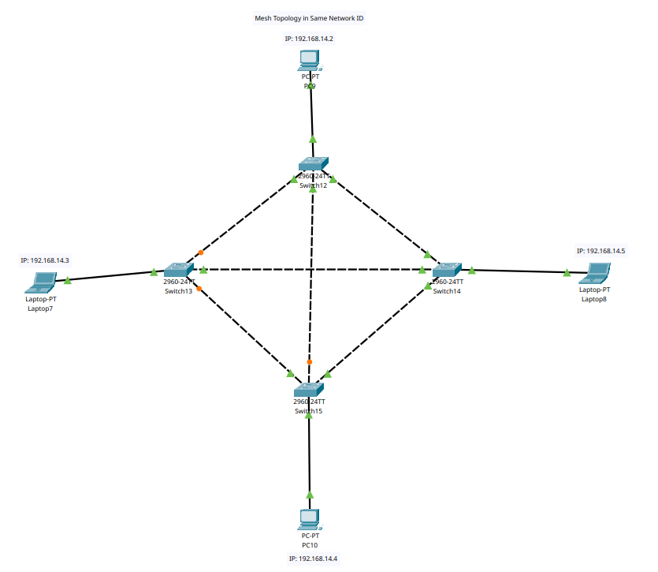
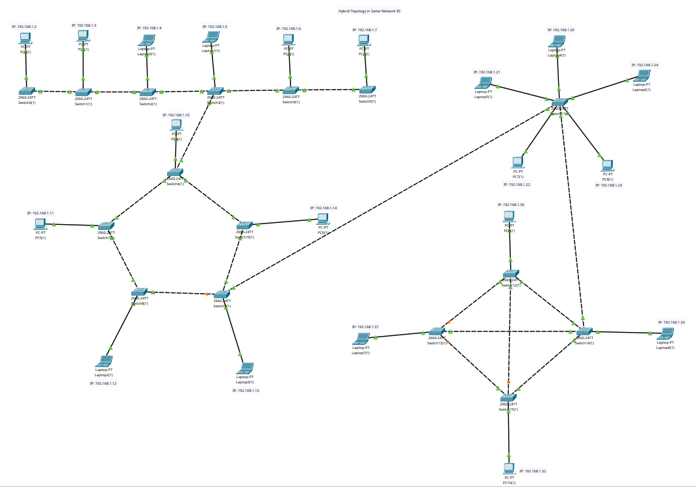
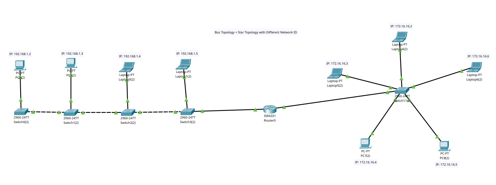

# 1. Check each topology with different network ID

- Every 2 Switches are connected with Copper Cross-Over wires.
- Every End-Device and Switch are connected with Copper Straight-Through wires.

## 1.1. Bus Topology

In a bus topology, all devices are connected to a single central cable (the "bus") and data is transmitted along the bus and received by all devices on the network.

**Advantages:**

- It is simple
- Easy to extend and troubleshoot

**Disadvatages:**

- It can become slow
- It will become inefficient if more devices are added

## 1.2 Ring Topology

In a ring topology, devices are connected in a circular manner, with each device connected to exactly two other devices. Data travels around the ring from one device to the next until it reaches its destination.

**Advantages:**

- Failure of one connection will not lead to entire network failure

**Disadvatages:**

- Setting up new connections is not easy
- Decreases speed if more devices added

## 1.3 Star Topology

In a star topology, all devices are connected to a central switch and each device has a dedicated connection to the central switch.

**Advantages:**

- Easy to troubleshoot
- Easy to add new devices

**Disadvatages:**

- Failure of central switch will lead to entire network failure

## 1.4 Mesh Topology

In a mesh topology, each device is connected to every other device on the network. This means that data can be sent along multiple paths.

**Advantages:**

- Failure of one or more connections will not lead to entire network failure
- Network traffic can be reduced

**Disadvatages:**

- Setting up new connections is not easy
- Troubleshooting is difficult
- Costly to implement

## 1.5 Hybrid Topology

A hybrid topology is a combination of two or more topologies.

**Advantages:**

- Multiple use-cases can be combined

**Disadvatages:**

- Fails if bridge connecting two topologies fails
- Troubleshooting is difficult

# 2. Check two or more topology with different network ID

- Every 2 Switches are connected with Copper Cross-Over wires.
- Every End-Device and Switch are connected with Copper Straight-Through wires.
- Every Switch and Router are connected with Copper Straight-Through wires.

## 2.1 Bus Topology + Star Topology

A Bus Topology is connected to a Star Topology with the help of a Router. Each Bus and Star Topology has a different Network ID.

