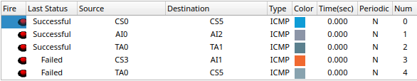

# VLAN Creation in the same network and verification

Logical split of same network into different VLANs:

- All PCs are connected to the same VLAN with number *100*
- All Laptops are connected to the same VLAN with number *200*
- All Servers are connected to the same VLAN with number *300*

# Questions

## 1. What are the advantages of VLAN?

- **Efficient Network Segmentation:** VLANs allow you to segment your network without having to run new cables or make major changes in your current network infrastructure. You can use your existing network infrastructure and simply configure your switches to segment your network.

- **Enhanced Security:** VLANs allow you to group users by function, not by location. This means that you can have users from different departments on the same floor, but on different VLANs. This allows you to implement security policies based on the function of the user, not their location.

- **IP Address Space Conservation:** VLANs allow you to efficiently use IP address space. Different VLANs can use the same IP address ranges without conflicts, as long as they are logically separated.

- **Testing and Development:** VLANs are useful for creating isolated environments for testing and development purposes. This prevents test traffic from interfering with production traffic.

## 2. What are the disadvantages of VLAN?

- **Complex Configuration:** Setting up and managing VLANs can be complex, particularly in larger networks. Configuration errors or mismanagement can lead to connectivity issues and security vulnerabilities.

- **Requires Layer 3 Device:** VLANs are Layer 2 constructs, so they can only communicate within the same VLAN. If you want to allow communication between VLANs (inter-VLAN communication), you need a Layer 3 device such as a router or Layer 3 switch.

- **Administrative Overhead:** Managing VLANs requires ongoing administration. This includes adding, modifying, and removing VLANs, as well as maintaining the routing and security settings.

## 3. How inter-VLAN communication happen?

1. **Router or Layer 3 Switch:** To enable communication between different VLANs, you need a device that can perform routing between them. This device could be a router or a layer 3 switch.

2. **IP Addressing:** Each VLAN is assigned a distinct IP subnet. Devices within a VLAN use IP addresses from that subnet. The router or layer 3 switch has an IP address for each VLAN it connects to. These IP addresses act as gateways for the devices in their respective VLANs.

3. **Routing:** When a device in one VLAN wants to communicate with a device in another VLAN, it sends the traffic to its default gateway (the router or layer 3 switch). The router examines the destination IP address and determines which VLAN it belongs to. It then forwards the traffic to the appropriate VLAN.