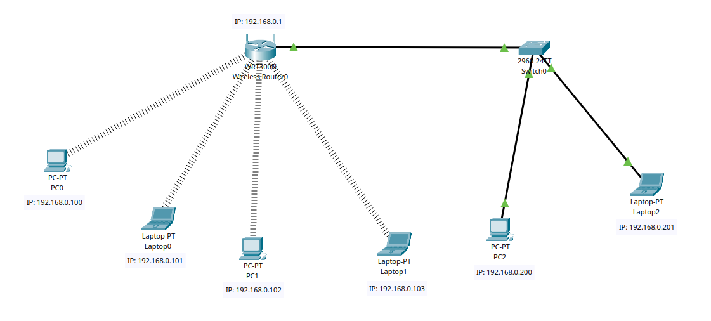
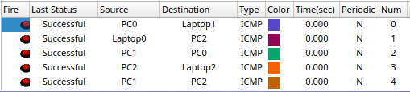

# Wireless Local Area Network (WLAN)

This report outlines the setup and configuration of a Wireless Local Area Network (WLAN) consisting of a wireless router, multiple end devices, a switch, and wired connections.

## Network Components:

1. **Wireless Router:** A wireless router is the central component of the network. It serves as the access point for wireless devices and provides routing and internet connectivity. The router is configured with static IP addresses and serves as the gateway.

2. **End Devices (Wireless):** There are four wireless end devices connected to the WLAN. These devices access the network via Wi-Fi connections provided by the wireless router.

3. **End Devices (Wired):** Two end device is connected via a wired connection. It is connected to a switch for wired connectivity.

4. **Switch:** A network switch is used to expand the wired connectivity of the network. It connects two wired end device to the network. The switch acts as a local network hub, allowing multiple devices to communicate within the LAN.

## Configuration Details:

- **Wireless Router:** The router is configured with static IP addresses to provide stability and consistency to the network. This means that the router has a fixed IP address assigned to it, and this address doesn't change over time. The router is also configured with appropriate security settings, such as Wi-Fi encryption (e.g., WEP) and a strong administrative password.

- **End Devices (Wireless):** The wireless end devices are configured to connect to the router's Wi-Fi network using the provided SSID (Service Set Identifier) and password or security key. They are manually set up with static IP addresses and gateway to the router.

- **End Devices (Wired):** The wired end device connected to the switch is also configured to obtain with static IP addresses and gateway to the router.

- **Switch:** The switch is a plug-and-play device that doesn't require extensive configuration. It automatically forwards data between devices within the LAN, enabling wired devices to communicate with each other and with the wireless devices connected to the router.

