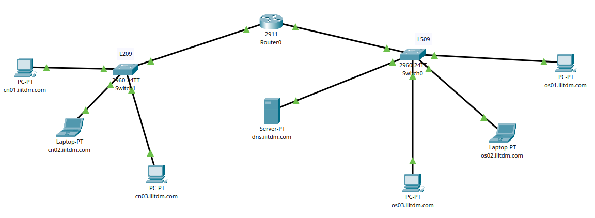
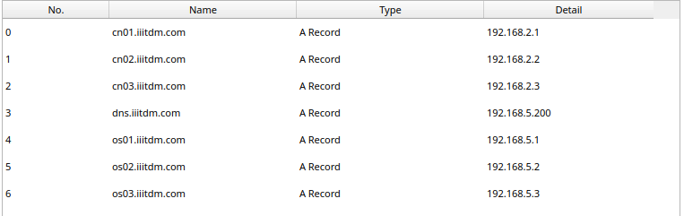
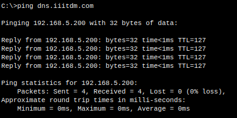
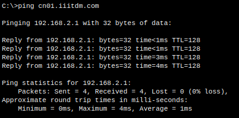
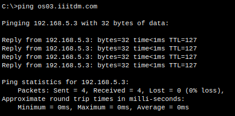

# What is DNS?

DNS, or Domain Name System, is like the internet's phonebook. It converts user-friendly domain names (like www.example.com) into the actual IP addresses (like 192.168.1.1) that computers use to find each other and connect across the internet. This system helps us navigate the web by translating human-readable names into machine-readable addresses.

# Network Setup

- **Router:** A router is used to connect 2 Different LAN Networks namely, *LAN L209* and *LAN L509*.

- **Switches:** A switch is used to connect the end devices inside each of the LANs.

- **End Devices:** 3 end devices (2 PCs, 1 Laptop) are connected in each of the LANs. Each end devices are configured with a static IP address, gateway of the router of their respective LAN. All devices's DNS is configured to be the DNS Server's IP address.
  - *LAN L209* is given a domain name of *cn\*\*.iiitdm.com*
  - *LAN L509* is given a domain name of *os\*\*.iiitdm.com*

- **Server:** A server is connected to *LAN L509* and is configured to act as a DNS Server.
  

# Testing DNS Server

- **Ping to DNS Server:**
  
  

- **Ping to L209:**
  
  

- **Ping to L509:**
  
  