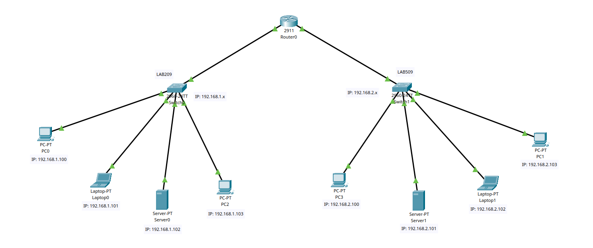
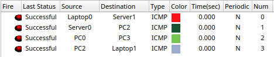

# What is DHCP?

DHCP, or Dynamic Host Configuration Protocol, is a standardized network protocol used on Internet Protocol (IP) networks for dynamically distributing network configuration parameters, such as IP addresses for interfaces and services. With DHCP, computers request IP addresses and networking parameters automatically from a DHCP server, reducing the need for a network administrator or a user to configure these settings manually.

# Network Setup



- Router is configured as DHCP Server, connected to 2 different networks
- 2 Switches are connected to the router have separate local networks
  - *LAB209*: `192.168.1.x`
  - *LAB509*: `192.168.2.x`
- Each switch is connected to 4 End Devices: 2 PCs , 1 Laptop and 1 Server

# DHCP Server Configuration

## Exclude IP Addresses

Exclude the following IP addresses from automatic assignment

```bash
$ ip dhcp excluded-address 192.168.1.0 192.168.1.99
```

## DHCP Pool

Create virtual interface for DHCP pool. Set the default router port, DNS server etc.

```bash
$ ip dhcp pool LAB209
$ default-router 192.168.1.1
$ dns-server 192.168.1.2
$ option 150 ip 192.168.1.3
$ network 192.168.1.0
```

# DHCP Client Configuration

1. Select DHCP as the method of IP address assignment

2. Automatically IP address will be assigned to the client with a message of "DHCP request successfull".

