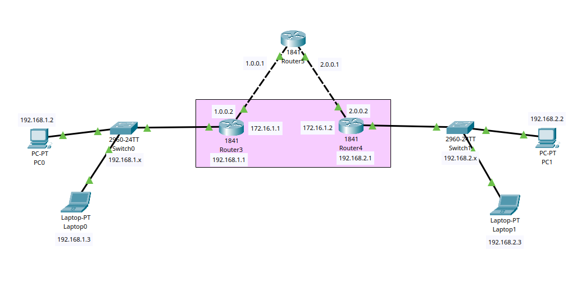
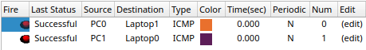
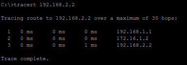
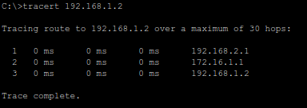

# What is a VPN?

A VPN (Virtual Private Network), is a technology that allows for secure communication and data exchange over a public network, such as the internet. It creates an encrypted and private connection between two or more devices, typically used to establish a secure connection between remote networks or individual devices.

In Cisco Packet Tracer, a VPN can be implemented using various Cisco devices like routers, switches, and security appliances. VPNs are widely used to enhance network security and privacy, connect remote offices, enable secure remote access for users, and protect data while in transit.

# Network Setup



- 2 Local Networks (LAN0 and LAN1) are connected to the Internet via a Router.
- Each Local Network has a PC and a Laptop connected to a Router through a Switch.
- **LAN0:** *192.168.1.1* (Gateway)
  - PC0: *192.168.1.2*
  - Laptop0: *192.168.1.3*
- **LAN1:** *192.168.2.1* (Gateway)
  - PC1: *192.168.2.2*
  - Laptop1: *192.168.2.3*

# VPN Configuration

VPN Configuration done in each of the routers.

## 1. Create a VPN Tunnel

```bash
# Creates a tunnel interface with the number 0.
$ interface tunnel 0
```

## 2. Configure the Tunnel Source and Destination

```bash
# Configures the source and destination of the tunnel.
$ tunnel source <source-router-interface>
$ tunnel destination <destination-router-ip>
```

# Message Flow



1. PC0 sends a ping request to PC1.



2. PC1 sends a ping request to PC0.

